# Rite Next.js App - Current Functionality Flowcharts

## Overview

This document provides comprehensive flowcharts for the current Next.js application functionality, including user flows, authentication patterns, data management, and system architecture.

---

## 1. High-Level System Architecture

---

## 2. User Authentication Flow

---

## 3. Event Creation Flow

---

## 4. DJ Submission Flow (No Authentication Required)

---

## 5. Dashboard Overview Flow

---

## 6. Event Status & Phase Management

```mermaid
stateDiagram-v2
    [*] --> Draft: Create Event
    Draft --> Planning: Publish Event
    Planning --> Finalized: Finalize Details
    Finalized --> DayOf: Event Day Starts
    DayOf --> Completed: Event Ends

    Draft --> Cancelled: Cancel Event
    Planning --> Cancelled: Cancel Event
    Finalized --> Cancelled: Cancel Event

    state Draft {
        [*] --> CanEdit
        CanEdit --> CanPublish
    }

    state Planning {
        [*] --> AcceptingSubmissions
        AcceptingSubmissions --> CanGenerateContent
    }

    state Finalized {
        [*] --> ReadOnly
        ReadOnly --> ShowUrgentBanner
    }

    state DayOf {
        [*] --> DayOfFeatures
        DayOfFeatures --> LiveUpdates
    }

    state Completed {
        [*] --> ArchiveReady
    }

    note right of Draft: • Can edit all details\n• Can add/remove timeslots\n• Generate submission links
    note right of Planning: • Accept DJ submissions\n• Generate promo content\n• Send reminders
    note right of Finalized: • Read-only mode\n• Show urgent banners\n• Final preparations
    note right of DayOf: • Day-of features active\n• Real-time updates\n• Live coordination
```

---

## 7. Theme System Architecture

---

## 8. Internationalization Flow

---

## 9. File Upload & Storage Flow

---

## 10. Instagram Integration Architecture (Planned)

---

## 11. Mobile App Integration (Expo)

---

## 12. Data Security & Privacy Flow

---

## Summary

The current Rite Next.js application implements a comprehensive event management system with the following key features:

### ✅ **Implemented Features**

- **Authentication**: NextAuth v5 with Instagram/Google OAuth
- **Event Management**: Full CRUD with phase-based status system
- **DJ Submissions**: Token-based, no-auth required submissions
- **File Handling**: Convex storage with automatic cleanup
- **Theme System**: Dynamic switching with CSS variables
- **Internationalization**: Korean/English support with next-intl
- **Mobile Support**: Expo app with shared backend
- **Security**: Encrypted sensitive data, GDPR compliance

### 🚧 **In Progress**

- **Instagram Integration**: Post generation templates
- **File Upload Enhancements**: Better validation and preview

### 📋 **Planned Features**

- **Instagram Publishing**: Automated posting for premium users
- **Advanced Analytics**: Event and submission insights
- **Email Notifications**: Automated reminders and updates
- **Advanced Mobile Features**: Push notifications, offline support

The architecture prioritizes **simplicity**, **reliability**, and **maintainability** while serving the Korean DJ community with culturally appropriate design and functionality.
