# RITE User Flows

This document outlines the key user flows in the RITE platform using Mermaid flowchart diagrams.

## Table of Contents

1. [Authentication Flow](#authentication-flow)
2. [Event Creation Flow](#event-creation-flow)
3. [DJ Submission Flow](#dj-submission-flow)
4. [Dashboard Overview Flow](#dashboard-overview-flow)
5. [Premium Upgrade Flow](#premium-upgrade-flow)

---

## Authentication Flow

---

## Event Creation Flow

---

## DJ Info Submission Flow

---

## Dashboard Overview Flow

---

## Premium Upgrade Flow

---

## Language Switching Flow

```mermaid
flowchart TD
    Start([User on Any Page]) --> LangButton[Click Language Switcher]
    LangButton --> ShowDropdown[Show Language Dropdown]

    ShowDropdown --> CurrentLang{Current Language}
    CurrentLang -->|English| ShowKorean[Show Korean Option 🇰🇷]
    CurrentLang -->|Korean| ShowEnglish[Show English Option 🇺🇸]

    ShowKorean --> SelectKorean[Select Korean]
    ShowEnglish --> SelectEnglish[Select English]

    SelectKorean --> UpdateRoute[Update Route with /ko/]
    SelectEnglish --> UpdateRoute2[Update Route with /en/]

    UpdateRoute --> LoadTranslations[Load Korean Translations]
    UpdateRoute2 --> LoadTranslations2[Load English Translations]

    LoadTranslations --> RefreshPage[Refresh with Korean UI]
    LoadTranslations2 --> RefreshPage2[Refresh with English UI]

    RefreshPage --> Complete[UI in Korean]
    RefreshPage2 --> Complete2[UI in English]

    style LangButton fill:#ffd93d
    style UpdateRoute fill:#4ecdc4
    style Complete fill:#95e1d3
```

---

## Mobile App Flow (Future)

---

## Notes

- **Real-time Updates**: All flows leverage Convex's real-time capabilities for instant data synchronization
- **Error Handling**: Each flow includes validation and error states to ensure data integrity
- **Internationalization**: All user-facing elements support Korean/English language switching
- **Mobile Optimization**: Web flows are responsive and work on mobile browsers
- **Security**: Token-based access for DJ submissions, OAuth for authentication
- **Progressive Enhancement**: Free users get full functionality, premium adds convenience features
